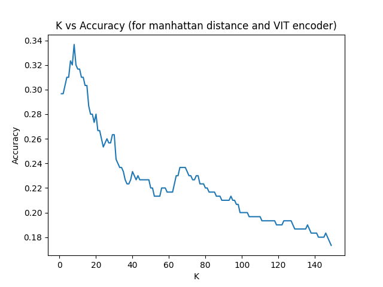

# K-Nearest Neighbours

### Task 1

#### Dataset Exploration

Draw a graph that shows the distribution of the various labels across the entire dataset.


### Task 2

#### KNN Implementation

Create a KNN class where you implement the following: You should not use sklearn for this.

1. Create a class where you can modify and access the encoder type, k, and distance metric (and any required parameter) of the class
2. Return the inference (prediction) when given the above parameters (encoder type, k, and distance metric).
3. Return the validation f-1 score, accuracy, precision, and recall after splitting the provided dataset into train and val subsets. You are allowed to use sklearn metrics for this part.

Examples:

- KNN(encoder_type='resnet', k=3, distance_metric='euclidean')
  - Accuracy: 21.00%
  - Precision: 14.19%
  - Recall: 14.16%
  - F1 Score: 12.94%
- KNN(encoder_type='vit', k=5, distance_metric='manhattan')
  - Accuracy: 26.33%
  - Precision: 17.84%
  - Recall: 18.31%
  - F1 Score: 16.80%
- KNN(encoder_type='resnet', k=7, distance_metric='cosine')
  - Accuracy: 22.00%
  - Precision: 11.84%
  - Recall: 15.94%
  - F1 Score: 12.46%

### Task 3

#### Hyperparameter Tuning

1. Find the best (k, encoder, distance metric) triplet that gives the best validation accuracy for a given data split (your choice).
2. Print an Ordered rank list of top 20 such triplets.
3. Plot k vs accuracy given a choice(yours) of any given distance, encoder pair (with a constant data split).

Best triplet: ((8, 'manhattan', 'vit'), 0.33666666666666667)

Top 20 triplets:

- ((8, 'manhattan', 'vit'), 0.33666666666666667)
- ((3, 'euclidean', 'vit'), 0.33)
- ((7, 'euclidean', 'vit'), 0.33)
- ((8, 'euclidean', 'vit'), 0.32666666666666666)
- ((4, 'euclidean', 'vit'), 0.3233333333333333)
- ((5, 'euclidean', 'vit'), 0.3233333333333333)
- ((6, 'manhattan', 'vit'), 0.3233333333333333)
- ((8, 'cosine', 'vit'), 0.3233333333333333)
- ((10, 'euclidean', 'vit'), 0.3233333333333333)
- ((6, 'euclidean', 'vit'), 0.32)
- ((7, 'manhattan', 'vit'), 0.32)
- ((9, 'euclidean', 'vit'), 0.32)
- ((9, 'manhattan', 'vit'), 0.32)
- ((10, 'manhattan', 'vit'), 0.31666666666666665)
- ((10, 'cosine', 'vit'), 0.31666666666666665)
- ((11, 'euclidean', 'vit'), 0.31666666666666665)
- ((11, 'manhattan', 'vit'), 0.31666666666666665)
- ((1, 'euclidean', 'vit'), 0.31333333333333335)
- ((2, 'euclidean', 'vit'), 0.31333333333333335)
- ((7, 'cosine', 'vit'), 0.31333333333333335)



### Task 4

#### Testing

Create a bash script that when given data from a file in the form of a list of test embeddings and test labels as a npy file exactly in the same format as the dataset file given to you, return the same metrics as discussed in task 1

```
+-----------+---------+
| Metric    | Score   |
+===========+=========+
| Accuracy  | 17.00%  |
+-----------+---------+
| Precision | 7.95%   |
+-----------+---------+
| Recall    | 11.39%  |
+-----------+---------+
| F1 Score  | 8.21%   |
+-----------+---------+
```
